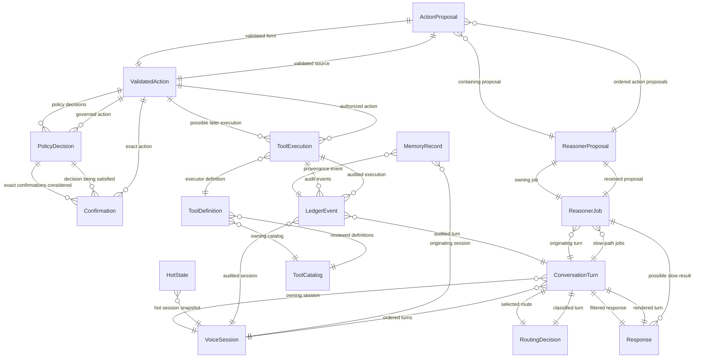

{/* Generated by `modelith render`. Do not edit by hand; edit the .modelith.yaml source and re-render. */}

# Talker Reasoner System Domain

The staged fast/slow voice-agent domain covering local fixture routing, async reasoner proposals, validated actions, policy confirmation, minimized audit, response rendering, and later governed tool and memory execution.

## Glossary

- **`AdminPlane`** - The human or controller-only surface that can change MCP servers, kits, tool catalogs, thresholds, and credentials.
- **`FastPath`** - The low-latency PersonaPlex conversation loop that may respond without waking the reasoner.
- **`Operator`** - The single authorized human who owns the prototype, consents to processing, confirms consequential actions, and administers the capability surface.
- **`ProcessingOnly`** - A value that may exist during a bounded turn for processing and must be released rather than persisted.
- **`RuntimePlane`** - The constrained surface available to a live voice turn. It can inspect and invoke allowlisted capabilities but cannot mutate the capability surface.
- **`SlowPath`** - The asynchronous reasoner, validation, policy, confirmation, and audited execution path.

## Enums

### `CatalogStatus`

Review and activation state of a tool catalog version.

| Value | Definition |
| --- | --- |
| `Draft` |  |
| `Reviewed` |  |
| `Active` |  |
| `Retired` |  |

### `DataBoundary`

Where processing is permitted for a turn or data record.

| Value | Definition |
| --- | --- |
| `localOnly` |  |
| `consentedCloud` |  |
| `prohibited` |  |

### `ExecutionStatus`

Lifecycle state of a governed tool execution.

| Value | Definition |
| --- | --- |
| `Proposed` |  |
| `Authorized` |  |
| `Dispatched` |  |
| `Succeeded` |  |
| `Failed` |  |
| `TimedOut` |  |
| `Rejected` |  |

### `JobStatus`

Lifecycle state of an asynchronous reasoner job.

| Value | Definition |
| --- | --- |
| `Pending` |  |
| `Running` |  |
| `WaitingConfirmation` |  |
| `Completed` |  |
| `Canceled` |  |
| `Downgraded` |  |
| `Failed` |  |

### `MemoryStatus`

Lifecycle state of a governed long-term memory record.

| Value | Definition |
| --- | --- |
| `Candidate` |  |
| `Approved` |  |
| `Active` |  |
| `Superseded` |  |
| `Rejected` |  |
| `Deleted` |  |

### `PolicyOutcome`

The complete policy preflight result set.

| Value | Definition |
| --- | --- |
| `allowedWithoutConfirmation` |  |
| `confirmationRequired` |  |
| `rejected` |  |

### `RiskLevel`

Router and action risk classification.

| Value | Definition |
| --- | --- |
| `low` |  |
| `medium` |  |
| `high` |  |
| `unevaluable` |  |

### `RouteLabel`

The deliberately small first routing label set.

| Value | Definition |
| --- | --- |
| `chitchat` | The fast talker may respond alone. |
| `needsTools` | The slow path must produce a validated proposal. |
| `unclear` | The system must clarify or fail closed. |

### `SessionStatus`

Operational state of one single-operator voice session.

| Value | Definition |
| --- | --- |
| `Active` | The session can process turns. |
| `Degraded` | The session remains open but a live component or policy check is unavailable. |
| `Closed` | The session has ended and processing-only values have been released. |

### `TerminalReason`

Explicit terminal outcome for a slow-path job.

| Value | Definition |
| --- | --- |
| `Completed` |  |
| `proposalInvalid` |  |
| `validationFailed` |  |
| `policyFailed` |  |
| `canceledByUser` |  |
| `turnSuperseded` |  |
| `staleTtlExpired` |  |
| `resultAgeExpired` |  |
| `materialIntentChanged` |  |
| `unsafePresentation` |  |
| `Downgraded` |  |

### `TurnStatus`

Lifecycle state of one user turn.

| Value | Definition |
| --- | --- |
| `Receiving` | Audio or typed input is being collected. |
| `Routed` | A valid routing decision has selected a path. |
| `SlowPath` | A reasoner job is active for this turn. |
| `AwaitingConfirmation` | The turn is waiting for exact operator confirmation. |
| `Responding` | A filtered response is being rendered. |
| `Terminal` | The turn is complete, canceled, blocked, or failed. |

## Entities

### `ActionProposal`

One typed but untrusted proposal to invoke a cataloged action. It contains canonical argument hashes or values, justification, subject, target, and provenance. It is not permission.

**Relationships**

- `ReasonerProposal` - n:1 - containing proposal
- `ValidatedAction` - 1:1 - validated form

**Attributes**

| Name | Type | Description |
| --- | --- | --- |
| `actionName` | string |  |
| `argumentsHash` | string |  |
| `justification` | string |  |
| `subject` | string |  |
| `target` | string |  |
| `provenance` | string |  |

**Actions**

- `propose` - actor `RuntimePlane`; preserves action-schema-fail-closed, action-no-credentials - Offer a typed action for validation without authority to execute.

**Invariants**

- **action-schema-fail-closed** - An `ActionProposal` with an unknown name, extra privileged argument, malformed type, out-of-range value, missing justification, or missing provenance must be rejected.
- **action-no-credentials** - An `ActionProposal` must not contain credentials, hidden prompts, or unrestricted arguments.

### `Confirmation`

Explicit operator consent for one exact validated action hash, canonical arguments, subject, target, user, session, and policy version during a bounded TTL. It is never inferred from model confidence.

**Relationships**

- `PolicyDecision` - n:1 - decision being satisfied
- `ValidatedAction` - n:1 - exact action

**Attributes**

| Name | Type | Description |
| --- | --- | --- |
| `confirmationHash` | string |  |
| `actionHash` | string |  |
| `explicit` | boolean |  |
| `grantedAt` | timestamp |  |
| `expiresAt` | timestamp |  |

**Actions**

- `grant` - actor `Operator`; preserves confirmation-exact-and-expiring - Explicitly confirm one exact action.
- `consume` - actor `RuntimePlane`; preserves confirmation-single-use - Mark a confirmation used after exact policy match.
- `expire` - actor `RuntimePlane`; preserves confirmation-exact-and-expiring - Invalidate a confirmation when its TTL ends.

**Invariants**

- **confirmation-exact-and-expiring** - A `Confirmation` must match the exact action hash, canonical arguments, subject, target, user, session, and policy version and must expire within its bounded TTL.
- **confirmation-single-use** - A consumed `Confirmation` must not authorize a second or changed action.

### `ConversationTurn`

One operator utterance and its routing outcome. It owns the turn epoch and ephemeral transcript used by the fast and slow paths. It never grants action authority.

**Relationships**

- `VoiceSession` - n:1 - owning session
- `RoutingDecision` - 1:1 - owned - selected route
- `ReasonerJob` - 1:n - owned - slow-path jobs
- `Response` - 1:1 - owned - filtered response

**Attributes**

| Name | Type | Description |
| --- | --- | --- |
| `turnId` | string |  |
| `turnEpoch` | integer |  |
| `status` | TurnStatus |  |
| `ephemeralTranscript` | string |  |
| `inputHash` | string |  |
| `intentHash` | string |  |

**Actions**

- `transcribe` - actor `RuntimePlane`; preserves raw-input-ephemeral, transcriber-no-authority - Produce an ephemeral transcript and scoped input hash.
- `route` - actor `RuntimePlane`; preserves route-fail-closed, router-no-authority - Attach exactly one valid routing decision.
- `advanceEpoch` - actor `RuntimePlane`; preserves job-staleness-bounded - Supersede earlier slow work when operator intent materially advances.
- `cancel` - actor `Operator`; preserves job-staleness-bounded, canceled-work-silent - Cancel the turn and prevent normal slow-path rendering.
- `awaitConfirmation` - actor `RuntimePlane`; preserves policy-before-execution, confirmation-exact-and-expiring - Pause the turn while exact operator confirmation is required.
- `finish` - actor `RuntimePlane`; preserves raw-input-ephemeral, response-filtered - Terminalize the turn and release processing-only values.

**Invariants**

- **route-fail-closed** - Every `ConversationTurn` with missing, invalid, or unevaluable routing input must select `unclear` or a guarded terminal path, never `needsTools`.
- **transcriber-no-authority** - A transcription result must never validate actions, grant consent, or execute tools.
- **job-staleness-bounded** - A `ReasonerJob` must become canceled or downgraded when its `ConversationTurn` epoch, stale TTL, result age, or material intent no longer authorizes rendering.
- **canceled-work-silent** - A canceled slow-path result must not render as a normal answer.

### `HotState`

A bounded, short-lived session snapshot used by the live loop. It stores minimized keys and hashes with a TTL, not transcripts, credentials, or durable truth.

**Relationships**

- `VoiceSession` - n:1 - hot session snapshot

**Attributes**

| Name | Type | Description |
| --- | --- | --- |
| `snapshotVersion` | string |  |
| `ttlSeconds` | integer |  |
| `keysHash` | string |  |
| `dataBoundary` | DataBoundary |  |

**Actions**

- `write` - actor `RuntimePlane`; preserves hot-state-minimized, hot-state-ttl - Write a bounded minimized snapshot for the live loop.
- `expire` - actor `RuntimePlane`; preserves hot-state-ttl - Remove an expired snapshot.

**Invariants**

- **hot-state-minimized** - `HotState` must not contain raw audio, raw transcripts, credentials, or unfiltered tool output.
- **hot-state-ttl** - Every `HotState` value must have a finite TTL and deletion path.

### `LedgerEvent`

An immutable minimized audit record linking a route, proposal, validation, policy, confirmation, execution, state change, response, report, or integrity result to scoped hashes and prior-chain metadata.

**Relationships**

- `VoiceSession` - n:1 - audited session
- `ConversationTurn` - n:1 - audited turn
- `ToolExecution` - n:1 - audited execution

**Attributes**

| Name | Type | Description |
| --- | --- | --- |
| `eventId` | integer |  |
| `eventType` | string |  |
| `inputHash` | string |  |
| `contentLength` | integer |  |
| `mediaType` | string |  |
| `consentVersion` | string |  |
| `policyVersion` | string |  |
| `priorEventId` | integer |  |
| `priorEventHash` | string |  |
| `eventChainHash` | string |  |

**Actions**

- `append` - actor `RuntimePlane`; preserves ledger-append-only, ledger-minimized - Append one canonical event with prior identity and hash.
- `verify` - actor `RuntimePlane`; preserves ledger-integrity-fail-closed - Detect gaps, invalid prior hashes, duplicate terminals, and mutations.

**Invariants**

- **ledger-append-only** - A recorded `LedgerEvent` must never be updated or deleted during normal operation.
- **ledger-minimized** - A `LedgerEvent` must not contain raw audio, raw transcripts, credentials, hidden prompts, unhashed sensitive arguments, or unreviewed private tool output.
- **ledger-integrity-fail-closed** - A broken `LedgerEvent` chain must disable the affected action path rather than allow unaudited work.

### `MemoryRecord`

A later-phase governed long-term memory candidate with content hash, summary, provenance, consent, lifecycle, and deletion state. Memory platforms are deferred and never the sole source of truth.

**Relationships**

- `VoiceSession` - n:1 - originating session
- `LedgerEvent` - n:1 - provenance event

**Attributes**

| Name | Type | Description |
| --- | --- | --- |
| `memoryId` | string |  |
| `contentHash` | string |  |
| `summary` | string |  |
| `provenance` | string |  |
| `status` | MemoryStatus |  |
| `consentVersion` | string |  |

**Actions**

- `propose` - actor `RuntimePlane`; preserves memory-provenance-bound - Create a candidate from approved and classified content.
- `approve` - actor `Operator`; preserves memory-provenance-bound, memory-not-sole-truth - Approve only a reviewed candidate with consent.
- `activate` - actor `RuntimePlane`; preserves memory-provenance-bound, memory-not-sole-truth - Make an approved memory record available for governed recall.
- `recall` - actor `RuntimePlane`; preserves memory-provenance-bound, response-filtered - Retrieve bounded memory context with provenance.
- `supersede` - actor `RuntimePlane`; preserves memory-not-sole-truth - Replace an active record while preserving history.
- `delete` - actor `Operator`; preserves memory-deletable - Delete a record and propagate deletion to backups and derived stores.

**Invariants**

- **memory-provenance-bound** - Every `MemoryRecord` must retain content provenance, consent, review status, and a link to audited origin.
- **memory-not-sole-truth** - A `MemoryRecord` platform must never be the sole copy of important state.
- **memory-deletable** - Every approved `MemoryRecord` must have a tested deletion path covering primary and backup stores.

### `PolicyDecision`

The fail-closed preflight decision for one ValidatedAction. It is the only domain concept that can classify an action as allowed, requiring confirmation, or rejected.

**Relationships**

- `ValidatedAction` - n:1 - governed action
- `Confirmation` - 1:n - exact confirmations considered

**Attributes**

| Name | Type | Description |
| --- | --- | --- |
| `outcome` | PolicyOutcome |  |
| `rejectionCode` | string |  |
| `policyVersion` | string |  |
| `decidedAt` | timestamp |  |

**Actions**

- `preflight` - actor `RuntimePlane`; preserves policy-before-execution, policy-three-outcomes - Evaluate permission, risk, privacy, reversibility, scope, consent, and confirmation before execution.

**Invariants**

- **policy-before-execution** - A `ToolExecution` may be dispatched only after a `ValidatedAction` has an allowed policy outcome and every required exact confirmation is active.
- **policy-three-outcomes** - A `PolicyDecision` must resolve to exactly one of allowed without confirmation, confirmation required, or rejected; unevaluable policy is rejected.

### `ReasonerJob`

The asynchronous slow-path unit that requests one structured proposal and carries it through validation, policy, confirmation, and terminal presentation. It does not execute tools.

**Relationships**

- `ConversationTurn` - n:1 - originating turn
- `ReasonerProposal` - 1:1 - owned - received proposal

**Attributes**

| Name | Type | Description |
| --- | --- | --- |
| `jobId` | string |  |
| `status` | JobStatus |  |
| `terminalReason` | TerminalReason |  |
| `staleTtlSeconds` | integer |  |
| `resultMaxAgeSeconds` | integer |  |
| `responsePriority` | integer |  |

**Actions**

- `create` - actor `RuntimePlane`; preserves slow-path-only-after-route, reasoner-proposes-only - Create pending work only for a valid needs-tools turn.
- `run` - actor `RuntimePlane`; preserves reasoner-proposes-only, model-boundaries-explicit, talker-no-authority - Request exactly one typed proposal from the reasoner transport.
- `waitForConfirmation` - actor `RuntimePlane`; preserves policy-before-execution, confirmation-exact-and-expiring - Pause after policy requires exact operator confirmation.
- `complete` - actor `RuntimePlane`; preserves policy-before-execution, response-filtered - Complete only after all accepted actions and state updates are validated and authorized.
- `cancel` - actor `RuntimePlane`; preserves job-staleness-bounded, canceled-work-silent - Terminalize stale, superseded, or operator-canceled work.
- `downgrade` - actor `RuntimePlane`; preserves canceled-work-silent, response-filtered - Replace an unsafe or stale result with a bounded non-action summary.
- `fail` - actor `RuntimePlane`; preserves contract-fail-closed, canceled-work-silent - Terminalize invalid proposals, validation, policy, ledger, or presentation failures.

**Invariants**

- **slow-path-only-after-route** - A `ReasonerJob` must be created only for a `ConversationTurn` routed to `needsTools`.
- **reasoner-proposes-only** - A reasoner result is a `ReasonerProposal` and must never claim execution, grant permission, or bypass validation.

### `ReasonerProposal`

One immutable structured suggestion containing a bounded answer, ordered action proposals or a no-action marker, state-update intent, confidence, uncertainty, hashes, and provenance. It is untrusted until validated.

**Relationships**

- `ReasonerJob` - 1:1 - owning job
- `ActionProposal` - 1:n - owned - ordered action proposals

**Attributes**

| Name | Type | Description |
| --- | --- | --- |
| `schemaVersion` | string |  |
| `candidateAnswer` | string |  |
| `confidence` | number |  |
| `uncertainty` | number |  |
| `inputHash` | string |  |
| `catalogHash` | string |  |
| `policyVersion` | string |  |
| `provenance` | string |  |
| `refusalReason` | string |  |

**Actions**

- `submit` - actor `RuntimePlane`; preserves proposal-identity-bound, reasoner-proposes-only - Submit one proposal whose identity and hashes bind to its request.

**Invariants**

- **proposal-identity-bound** - A `ReasonerProposal` must match its job, session, turn, epoch, input hash, catalog hash, and policy version.
- **contract-fail-closed** - Invalid, ambiguous, unprovenanced, or unmatched model output must fail closed rather than enter validation as accepted.

### `Response`

The only user-facing rendering contract for a turn. It contains a filtered channel, priority, bounded text, state, provenance, and latency. It cannot execute tools or alter policy.

**Relationships**

- `ConversationTurn` - 1:1 - rendered turn
- `ReasonerJob` - n:1 - possible slow result

**Attributes**

| Name | Type | Description |
| --- | --- | --- |
| `responseId` | string |  |
| `channel` | string |  |
| `renderState` | string |  |
| `priority` | integer |  |
| `boundedText` | string |  |
| `latencyMs` | integer |  |

**Actions**

- `render` - actor `RuntimePlane`; preserves response-filtered, canceled-work-silent - Present only policy-safe bounded text through an allowed channel.
- `block` - actor `RuntimePlane`; preserves response-filtered - Refuse unsafe or failed presentation.
- `cancel` - actor `RuntimePlane`; preserves canceled-work-silent - Suppress a normal result after cancellation or supersession.

**Invariants**

- **response-filtered** - A `Response` must contain only bounded, classified, policy-safe content and must never expose credentials, hidden prompts, or unfiltered private tool output.

### `RoutingDecision`

The calibrated route classification for one turn. It records scores, selected label, risk, and policy versions. It is advisory and has no execution authority.

**Relationships**

- `ConversationTurn` - 1:1 - classified turn

**Attributes**

| Name | Type | Description |
| --- | --- | --- |
| `labels` | string |  |
| `selectedLabel` | RouteLabel |  |
| `confidence` | number |  |
| `risk` | RiskLevel |  |
| `thresholdsVersion` | string |  |
| `calibrationVersion` | string |  |

**Actions**

- `decide` - actor `RuntimePlane`; preserves route-fail-closed, router-no-authority, model-boundaries-explicit - Apply versioned calibration and thresholds to one transcript.

**Invariants**

- **router-no-authority** - A `RoutingDecision` must never confirm actions, contact tools, mutate state, or render a slow-path answer.

### `ToolCatalog`

A versioned, reviewed allowlist of typed action definitions, schemas, permissions, risks, scopes, bounds, provenance requirements, and rejection codes. The voice runtime never mutates it.

**Relationships**

- `ToolDefinition` - 1:n - owned - reviewed definitions

**Attributes**

| Name | Type | Description |
| --- | --- | --- |
| `catalogVersion` | string |  |
| `catalogHash` | string |  |
| `status` | CatalogStatus |  |
| `policyVersion` | string |  |

**Actions**

- `define` - actor `AdminPlane`; preserves catalog-reviewed-before-active, runtime-cannot-mutate-capability, tool-schema-provenance - Add or replace a definition in a draft catalog version.
- `review` - actor `AdminPlane`; preserves catalog-reviewed-before-active, tool-schema-provenance - Review schemas, provenance, risk, and policy for a proposed catalog.
- `activate` - actor `AdminPlane`; preserves catalog-reviewed-before-active, runtime-cannot-mutate-capability, tool-schema-provenance - Make one reviewed catalog version active.
- `retire` - actor `AdminPlane`; preserves runtime-cannot-mutate-capability - Remove a catalog version from future dispatch.

**Invariants**

- **catalog-reviewed-before-active** - An active `ToolCatalog` must be reviewed and must identify its schema, policy, provenance, and hash.
- **runtime-cannot-mutate-capability** - The `RuntimePlane` must not add, remove, reload, or reconfigure catalog or MCP capabilities.

### `ToolDefinition`

One allowlisted capability exposed through a catalog. It names the canonical action, source plane, input and output schemas, permission, risk, privacy, reversibility, scope, and idempotency. It is not executable authority by itself.

**Relationships**

- `ToolCatalog` - n:1 - owning catalog

**Attributes**

| Name | Type | Description |
| --- | --- | --- |
| `canonicalName` | string |  |
| `capability` | string |  |
| `sourcePlane` | string |  |
| `argumentSchemaHash` | string |  |
| `resultSchemaHash` | string |  |
| `permission` | string |  |
| `risk` | RiskLevel |  |
| `reversible` | boolean |  |
| `idempotent` | boolean |  |

**Actions**

- `define` - actor `AdminPlane`; preserves catalog-reviewed-before-active, runtime-cannot-mutate-capability, tool-schema-provenance - Add or change a definition only in a draft catalog.

**Invariants**

- **tool-schema-provenance** - Every `ToolDefinition` must carry independently reviewed input and output schema hashes and source provenance.

### `ToolExecution`

A later-phase dispatch of one already validated and policy-authorized action through a server-side executor. It owns credentials and output filtering and is absent from the first local slice.

**Relationships**

- `ValidatedAction` - n:1 - authorized action
- `ToolDefinition` - n:1 - executor definition
- `LedgerEvent` - 1:n - audit events

**Attributes**

| Name | Type | Description |
| --- | --- | --- |
| `executionId` | string |  |
| `status` | ExecutionStatus |  |
| `resultHash` | string |  |
| `latencyMs` | integer |  |
| `costClass` | string |  |
| `idempotencyKey` | string |  |

**Actions**

- `authorize` - actor `RuntimePlane`; preserves policy-before-execution, tool-allowlist-only - Bind an allowed validated action to an active catalog definition.
- `dispatch` - actor `RuntimePlane`; preserves credential-isolation, tool-allowlist-only - Send only canonical arguments through the server-side executor.
- `complete` - actor `RuntimePlane`; preserves tool-output-filtered, tool-result-not-sole-truth - Record a filtered result hash and bounded metadata.
- `fail` - actor `RuntimePlane`; preserves contract-fail-closed, tool-output-filtered - Record an executor error without exposing secrets or raw output.
- `timeout` - actor `RuntimePlane`; preserves contract-fail-closed - Bound executor latency and terminalize late work.

**Invariants**

- **tool-allowlist-only** - A `ToolExecution` may target only an active `ToolDefinition` named by the bound `ToolCatalog`.
- **credential-isolation** - Credentials may exist only inside the server-side `ToolExecution` boundary and must never reach a model, transcript, proposal, ledger, response, or memory record.
- **tool-output-filtered** - Unreviewed tool output must be classified and filtered before reaching a reasoner, response, memory, or persistent ledger.
- **tool-result-not-sole-truth** - A tool result must not become the sole source of durable truth without provenance and an auditable record.

### `ValidatedAction`

The deterministic result of validating one ActionProposal against an exact catalog version, consent record, and bounded state. Validation proves shape and scope only; it is not execution or final authorization.

**Relationships**

- `ActionProposal` - 1:1 - validated source
- `PolicyDecision` - 1:n - owned - policy decisions
- `ToolExecution` - 1:n - possible later execution

**Attributes**

| Name | Type | Description |
| --- | --- | --- |
| `actionHash` | string |  |
| `catalogVersion` | string |  |
| `policyVersion` | string |  |
| `privacyClassification` | string |  |
| `idempotent` | boolean |  |
| `reversible` | boolean |  |

**Actions**

- `validate` - actor `RuntimePlane`; preserves action-schema-fail-closed, action-no-credentials, catalog-version-pinned - Check canonical name, schema, bounds, scope, identity, consent, state, and provenance.

**Invariants**

- **catalog-version-pinned** - A `ValidatedAction` must bind its catalog version, policy version, action hash, and catalog hash and must become invalid if any changes.

### `VoiceSession`

A single-operator audio and text conversation. It owns turn sequencing and the active processing boundary. It is not a multi-user tenant and does not own tools or credentials.

**Relationships**

- `ConversationTurn` - 1:n - owned - ordered turns

**Attributes**

| Name | Type | Description |
| --- | --- | --- |
| `sessionId` | string |  |
| `status` | SessionStatus |  |
| `dataBoundary` | DataBoundary |  |
| `startedAt` | timestamp |  |
| `endedAt` | timestamp |  |

**Actions**

- `start` - actor `Operator`; preserves session-processing-boundary - Open a local or explicitly consented processing session.
- `degrade` - actor `RuntimePlane`; preserves route-fail-closed, raw-input-ephemeral - Mark a live dependency unavailable without bypassing policy.
- `close` - actor `RuntimePlane`; preserves raw-input-ephemeral, session-processing-boundary - End the session and release processing-only values.

**Invariants**

- **session-processing-boundary** - A `VoiceSession` must record whether processing is `localOnly` or `consentedCloud`, and cloud processing requires explicit consent.
- **raw-input-ephemeral** - Raw audio and raw transcript values are `ProcessingOnly` and must be released when their `ConversationTurn` or `VoiceSession` ends.

## Relationships

## Invariants

- **talker-no-authority** - PersonaPlex or Moshi talker output must never validate actions, grant consent, contact tools, or mutate durable state.
- **model-boundaries-explicit** - The system must treat PersonaPlex as talker, Voxtral Realtime as transcription, Jev as router, and the direct reasoner as proposal source; no adapter may collapse these boundaries.

## Scenarios

### Confident chitchat stays fast

**Actors:** Operator, VoiceSession, ConversationTurn, RoutingDecision

**Steps**

1. The `Operator` opens a `VoiceSession`.
2. A `ConversationTurn` is transcribed with an ephemeral transcript.
3. `RoutingDecision` selects `chitchat` above threshold.
4. `ConversationTurn` terminalizes without creating a `ReasonerJob`.
5. `VoiceSession` closes and releases processing-only values.

**Invariants touched**

- **raw-input-ephemeral** - Raw audio and raw transcript values are `ProcessingOnly` and must be released when their `ConversationTurn` or `VoiceSession` ends.
- **route-fail-closed** - Every `ConversationTurn` with missing, invalid, or unevaluable routing input must select `unclear` or a guarded terminal path, never `needsTools`.
- **router-no-authority** - A `RoutingDecision` must never confirm actions, contact tools, mutate state, or render a slow-path answer.
- **slow-path-only-after-route** - A `ReasonerJob` must be created only for a `ConversationTurn` routed to `needsTools`.

### Tool request produces but does not execute an action

**Actors:** Operator, ConversationTurn, ReasonerJob, ReasonerProposal, ValidatedAction, PolicyDecision

**Steps**

1. `RoutingDecision` selects `needsTools`.
2. `ReasonerJob` requests one `ReasonerProposal`.
3. An `ActionProposal` is validated as a `ValidatedAction`.
4. `PolicyDecision` requires confirmation.
5. The first slice completes without creating a `ToolExecution`.

**Invariants touched**

- **slow-path-only-after-route** - A `ReasonerJob` must be created only for a `ConversationTurn` routed to `needsTools`.
- **reasoner-proposes-only** - A reasoner result is a `ReasonerProposal` and must never claim execution, grant permission, or bypass validation.
- **action-schema-fail-closed** - An `ActionProposal` with an unknown name, extra privileged argument, malformed type, out-of-range value, missing justification, or missing provenance must be rejected.
- **policy-before-execution** - A `ToolExecution` may be dispatched only after a `ValidatedAction` has an allowed policy outcome and every required exact confirmation is active.
- **tool-allowlist-only** - A `ToolExecution` may target only an active `ToolDefinition` named by the bound `ToolCatalog`.

### Invalid router calibration fails closed

**Actors:** ConversationTurn, RoutingDecision, Response

**Steps**

1. The ephemeral transcript is present but calibration is missing or invalid.
2. `RoutingDecision` refuses `needsTools`.
3. `ConversationTurn` selects a guarded unclear path.
4. `Response` renders only a bounded clarification.

**Invariants touched**

- **route-fail-closed** - Every `ConversationTurn` with missing, invalid, or unevaluable routing input must select `unclear` or a guarded terminal path, never `needsTools`.
- **router-no-authority** - A `RoutingDecision` must never confirm actions, contact tools, mutate state, or render a slow-path answer.
- **response-filtered** - A `Response` must contain only bounded, classified, policy-safe content and must never expose credentials, hidden prompts, or unfiltered private tool output.

### Stale job cannot interrupt

**Actors:** Operator, ConversationTurn, ReasonerJob, Response

**Steps**

1. A `ReasonerJob` begins for one turn epoch.
2. The `Operator` materially advances intent.
3. `ConversationTurn` advances its epoch.
4. `ReasonerJob` becomes canceled or downgraded.
5. `Response` does not present the old result as a normal answer.

**Invariants touched**

- **job-staleness-bounded** - A `ReasonerJob` must become canceled or downgraded when its `ConversationTurn` epoch, stale TTL, result age, or material intent no longer authorizes rendering.
- **canceled-work-silent** - A canceled slow-path result must not render as a normal answer.
- **response-filtered** - A `Response` must contain only bounded, classified, policy-safe content and must never expose credentials, hidden prompts, or unfiltered private tool output.

### Exact confirmation is single-use

**Actors:** Operator, ValidatedAction, PolicyDecision, Confirmation

**Steps**

1. `PolicyDecision` requires confirmation.
2. The `Operator` grants a `Confirmation` for exact canonical arguments.
3. `PolicyDecision` consumes the confirmation.
4. A later changed or repeated action fails policy.

**Invariants touched**

- **confirmation-exact-and-expiring** - A `Confirmation` must match the exact action hash, canonical arguments, subject, target, user, session, and policy version and must expire within its bounded TTL.
- **confirmation-single-use** - A consumed `Confirmation` must not authorize a second or changed action.
- **policy-before-execution** - A `ToolExecution` may be dispatched only after a `ValidatedAction` has an allowed policy outcome and every required exact confirmation is active.

### Ledger privacy canary

**Actors:** ConversationTurn, ReasonerJob, LedgerEvent, MemoryRecord

**Steps**

1. A canary appears in spoken input, proposal text, and tool output.
2. Only scoped hashes and classified metadata are appended.
3. `LedgerEvent` and any future `MemoryRecord` are inspected.
4. No non-consented canary persists.

**Invariants touched**

- **raw-input-ephemeral** - Raw audio and raw transcript values are `ProcessingOnly` and must be released when their `ConversationTurn` or `VoiceSession` ends.
- **ledger-minimized** - A `LedgerEvent` must not contain raw audio, raw transcripts, credentials, hidden prompts, unhashed sensitive arguments, or unreviewed private tool output.
- **memory-provenance-bound** - Every `MemoryRecord` must retain content provenance, consent, review status, and a link to audited origin.
- **memory-deletable** - Every approved `MemoryRecord` must have a tested deletion path covering primary and backup stores.

### Runtime cannot expand capability surface

**Actors:** RuntimePlane, AdminPlane, ToolCatalog, ToolDefinition, ToolExecution

**Steps**

1. Untrusted tool text requests addition of a new MCP server.
2. The `RuntimePlane` attempts only list, inspect, status, or allowlisted proxy use.
3. Only the `AdminPlane` can review and activate a new `ToolCatalog`.
4. `ToolExecution` rejects the non-allowlisted request.

**Invariants touched**

- **runtime-cannot-mutate-capability** - The `RuntimePlane` must not add, remove, reload, or reconfigure catalog or MCP capabilities.
- **catalog-reviewed-before-active** - An active `ToolCatalog` must be reviewed and must identify its schema, policy, provenance, and hash.
- **tool-allowlist-only** - A `ToolExecution` may target only an active `ToolDefinition` named by the bound `ToolCatalog`.
- **tool-output-filtered** - Unreviewed tool output must be classified and filtered before reaching a reasoner, response, memory, or persistent ledger.

### Fast and slow state remain independent

**Actors:** Operator, FastPath, SlowPath, HotState

**Steps**

1. The `FastPath` keeps conversational rendering independent of slow work.
2. The `SlowPath` creates an asynchronous `ReasonerJob`.
3. `HotState` stores only a minimized TTL-bound snapshot.
4. The `Operator` interrupts or changes intent before slow completion.
5. The stale slow result is canceled or downgraded without blocking the `FastPath`.

**Invariants touched**

- **hot-state-minimized** - `HotState` must not contain raw audio, raw transcripts, credentials, or unfiltered tool output.
- **hot-state-ttl** - Every `HotState` value must have a finite TTL and deletion path.
- **job-staleness-bounded** - A `ReasonerJob` must become canceled or downgraded when its `ConversationTurn` epoch, stale TTL, result age, or material intent no longer authorizes rendering.
- **canceled-work-silent** - A canceled slow-path result must not render as a normal answer.

